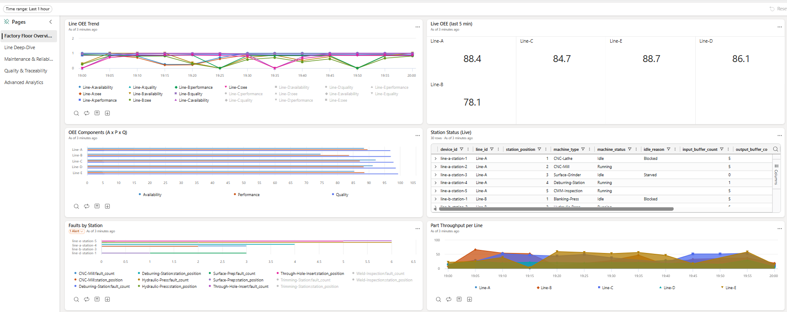

# Real-Time OEE Dashboard on Microsoft Fabric

A real-time **Overall Equipment Effectiveness (OEE)** dashboard built on [Microsoft Fabric](https://learn.microsoft.com/fabric/). Simulates a factory floor with **5 production lines (30 machines)** streaming telemetry into Fabric Eventstream, then routes, enriches, and visualizes the data through KQL, Real-Time Dashboards, and Activator alerts.

This demo models **true production-line OEE** — parts flow sequentially through ordered stations, faults cascade starvation and blocking via bounded buffers, and maintenance work orders gate machine recovery.

**OEE = Availability × Performance × Quality**



## Architecture

```
.NET Simulator (5 production lines, 30 stations)
  Parts flow: Station 1 → [Buffer] → Station 2 → [Buffer] → ... → Station N
  Events: machine_telemetry | part_event | maintenance_event
       │
       │  Event Hub Protocol
       ▼
Fabric Eventstream
       │
       ├── SQL Query: event_type = 'machine_telemetry' ──► MachineEvents table
       ├── SQL Query: event_type = 'part_event'         ──► PartEvents table
       └── SQL Query: event_type = 'maintenance_event'  ──► MaintenanceEvents table

Eventhouse — KQL Database
  [StationMaster]       ← reference (per-station ideal cycle times)
  [LineMaster]          ← reference (line metadata)
  [ProductionSchedule]  ← reference (planned targets per shift)

KQL Database ──► OEE_5min Materialized View
             ──► Real-Time Dashboard (4 pages)
             ──► Activator (fault + maintenance alerts)
```

## Production Lines

| Line | Name | Stations | Purpose |
|------|------|----------|---------|
| Line-A | Precision Machining | 5 | Raw bar stock → machined shaft |
| Line-B | Sheet Metal Forming | 4 | Sheet metal → stamped housing |
| Line-C | Welding & Assembly | 6 | Components → welded subassembly |
| Line-D | Surface Treatment | 7 | Raw part → painted/coated finished part |
| Line-E | Electronics Assembly | 8 | Bare PCB → tested electronics module |

### Key Behaviors

- **Cascading faults:** A downed station starves downstream and blocks upstream via bounded buffers (capacity: 5 parts)
- **Maintenance gating:** Faulted machines enter Maintenance state and cannot resume until the work order is resolved
- **Part tracking:** Every part has a unique ID and full station-by-station traceability
- **OEE formula:** Availability = Running / (Running + Fault + Maintenance) — Starved/Blocked time is excluded

## Prerequisites

- Microsoft Fabric capacity (F2 or higher) with Real-Time Intelligence enabled
- A Fabric workspace with contributor access
- [.NET 8 SDK](https://dotnet.microsoft.com/download/dotnet/8.0) installed (to build and run the simulator)
- OR [Docker](https://docs.docker.com/get-docker/) installed

## Quick Start

1. **Clone the repo:**
   ```bash
   git clone https://github.com/howardginsburg/FabricOEEDemo.git
   cd FabricOEEDemo
   ```

2. **Follow the tutorial** — [FABRIC_OEE_TUTORIAL.md](FABRIC_OEE_TUTORIAL.md) walks through every step:
   - Create an Eventstream with a custom endpoint
   - Configure and run the simulator
   - Create an Eventhouse with 3 KQL tables and reference data
   - Route events with 3 SQL Query operators
   - Build OEE KQL queries and a materialized view
   - Build a 4-page Real-Time Dashboard (manually or import the template)
   - Configure Activator alerts

3. **Configure the simulator:**
   ```bash
   cd simulator/FabricOEESimulator
   cp simulator.sample.yaml simulator.yaml
   # Edit simulator.yaml — paste your Eventstream connection string
   ```

4. **Run the simulator:**
   ```bash
   dotnet run
   ```
   
   Or with Docker:
   ```bash
   cd simulator
   docker build -t oee-simulator .
   docker run -it --rm -v "$(pwd)/FabricOEESimulator/simulator.yaml:/app/simulator.yaml" oee-simulator
   ```

## Automated Setup

Instead of following the tutorial manually, run the provisioner script:

```bash
bash completed_tutorial_build.sh --workspace-name "My Workspace"
```

This creates the Eventhouse, KQL Database, tables, reference data, materialized view, Eventstream with routing, and imports the dashboard via the Fabric REST API.

## Repository Contents

| Path | Description |
|------|-------------|
| `FABRIC_OEE_TUTORIAL.md` | Step-by-step tutorial (7 steps) |
| `completed_tutorial_build.sh` | Automated Fabric provisioner script |
| `oee-dashboard.template.json` | Importable 4-page Real-Time Dashboard template |
| `simulator/` | .NET 8 console app simulator |
| `simulator/FabricOEESimulator/` | Simulator source code |
| `simulator/FabricOEESimulator/simulator.sample.yaml` | Sample configuration file |
| `simulator/Dockerfile` | Docker build for the simulator |

## Dashboard Pages

1. **Factory Floor Overview** — Line OEE trend, live OEE scores, OEE components breakdown, station status grid, faults by station, parts throughput, OEE loss waterfall
2. **Line Deep-Dive** — Per-station OEE, station pipeline with buffer levels, cascade alerts (starved/blocked), actual vs ideal cycle times (filtered by line)
3. **Maintenance & Reliability** — Open work orders, MTTR by machine type, fault Pareto, WO lifecycle, equipment age vs OEE
4. **Quality & Traceability** — Rejection rate by station, part journey (full traceability by part ID), quality trend, shift KPIs, schedule adherence
